# Regex Playground

**English** · [Português (Brasil)](README.pt-BR.md)

[](https://github.com/FabianoArthur/aula-1/actions/workflows/ci.yml)
[](LICENSE)

Write a regular expression, see what it matches as you type, and read what every part of it means in
plain English. The explanations come from a regex parser written from scratch. No AI and no server are
involved, and nothing you type leaves the page.

**Live demo:** <https://fabianoarthur.github.io/aula-1/>


## Why it is interesting

- **A real parser, not a lookup table.** `src/regex/parser.ts` is a recursive-descent parser for
  ECMAScript regular expressions. It turns the pattern into a syntax tree with source spans. It
  follows the engine's rules in both modes: legacy web syntax without `u`, where `\101` is octal and a
  lone `{` is a literal, and the stricter unicode mode.
- **Checked against the engine itself.** A differential test generates 20,000 random patterns and
  checks each one in both modes. For every pattern, the parser must accept or reject exactly what
  `new RegExp` does. A longer run of 600,000 checks found no disagreement.
- **Explanations you can point at.** Every line of the explanation knows which slice of the pattern
  it describes. Hover or focus a line and that slice lights up in the pattern.
- **A slow pattern can't freeze the page.** Matching runs in a Web Worker. If a pattern backtracks
  catastrophically, like `(a+)+$` against `aaaa…!`, the worker is stopped after 1 second and replaced.
- **Links you can share.** The pattern, flags and test text go into the URL hash, so a link
  reopens the same state. Nothing is stored on a server.
- **Safe rendering.** User text is only ever inserted with DOM text nodes. ESLint bans `innerHTML`, and
  the production build ships a strict Content-Security-Policy.

| Light | Dark |
| --- | --- |
|  |  |

## Features

- Live highlighting of every match in the test text, plus a list of matches with their capture groups
  (named and numbered) and positions.
- A plain-English tree for the pattern: literals, classes, ranges, anchors, groups, lookarounds,
  backreferences, greedy and lazy quantifiers, Unicode property escapes, and what each flag does.
- Syntax errors reported with their position, which is marked in the pattern.
- Flag toggles for `g i m s u v y d`.
- A library of 12 common patterns (ISO date, e-mail, URL, IPv4, UUID, semver…). The test suite checks
  that each one matches and rejects what it claims to.
- Keyboard accessible, light and dark themes, and a responsive layout down to phone width.

## How it works

<picture>
  <source media="(prefers-color-scheme: dark)" srcset="docs/assets/how-it-works-dark.svg">
  
</picture>

| Module | Responsibility |
| --- | --- |
| `src/regex/parser.ts` | Pattern → syntax tree with source spans, or a `RegexSyntaxError` with its position |
| `src/regex/explain.ts` | Syntax tree → tree of plain-English lines, each tied to its span |
| `src/regex/match.ts` | Runs the native engine the way `exec` does. Collects matches and groups, handles empty matches, caps results at 1,000 |
| `src/worker/` | Runs matching off the main thread, drops stale results, kills a runaway match after 1 s |
| `src/highlight.ts` | Text + matches → ordered segments for the highlight layer |
| `src/share.ts` | State ↔ URL hash, with flag cleaning and a length guard |
| `src/library.ts` | The common-patterns library, with positive and negative examples |
| `src/main.ts` | DOM wiring. No framework, about 30 kB of JavaScript before compression |

## Running locally

Requires Node.js 20 or newer.

```bash
npm ci
npm run dev        # http://localhost:5173
```

| Script | What it does |
| --- | --- |
| `npm test` | Unit tests (Vitest) |
| `npm run lint` | ESLint with typescript-eslint |
| `npm run typecheck` | `tsc --noEmit` in strict mode |
| `npm run build` | Type-check and build to `dist/` |
| `npm run preview` | Serve the production build |

## Tests

192 tests across the parser, explainer, matcher, worker runner, highlighter, share-link codec and pattern library,
including the differential test against the engine. CI runs lint, the type check, the tests, the build
and a gitleaks secret scan on every push and pull request.

## Deployment

`.github/workflows/deploy.yml` builds the site and publishes it to GitHub Pages on every push to the
default branch.

## License

[MIT](LICENSE) © 2026 Fabiano Arthur
