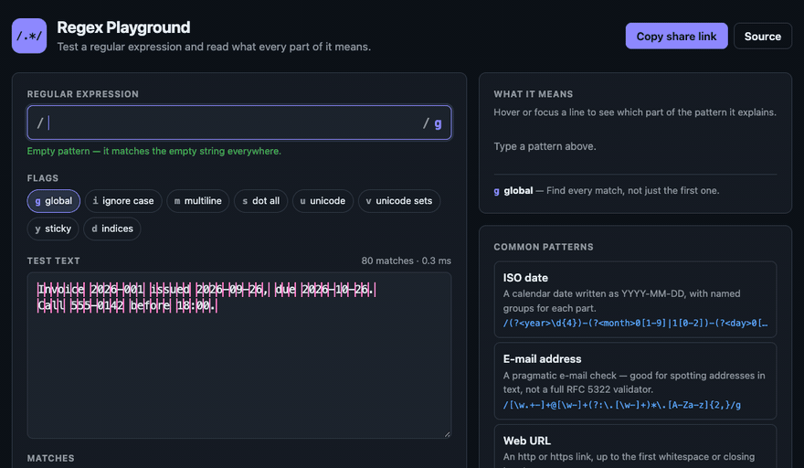
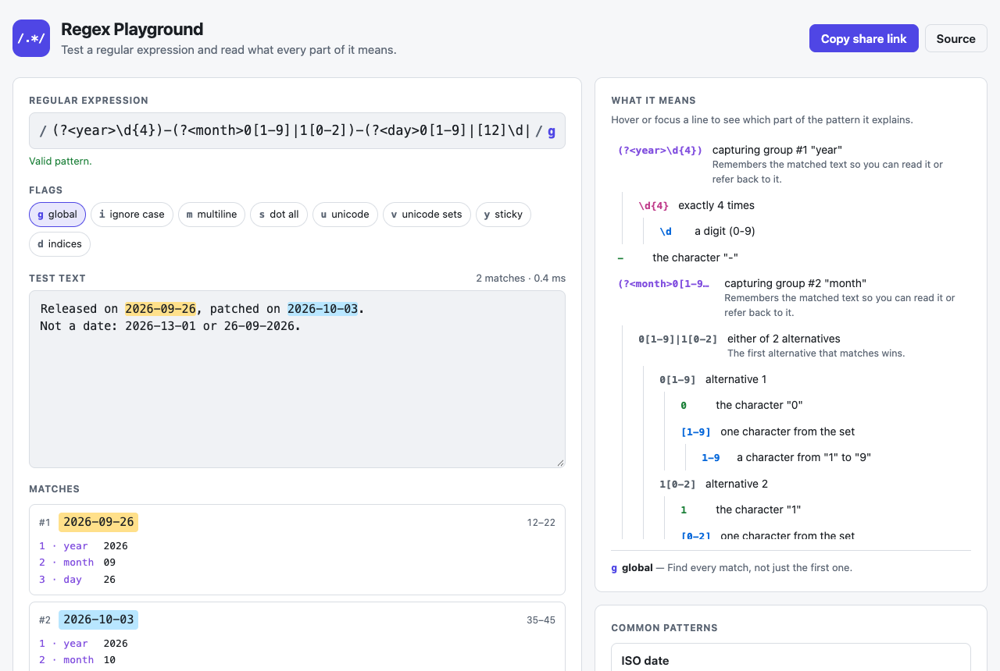
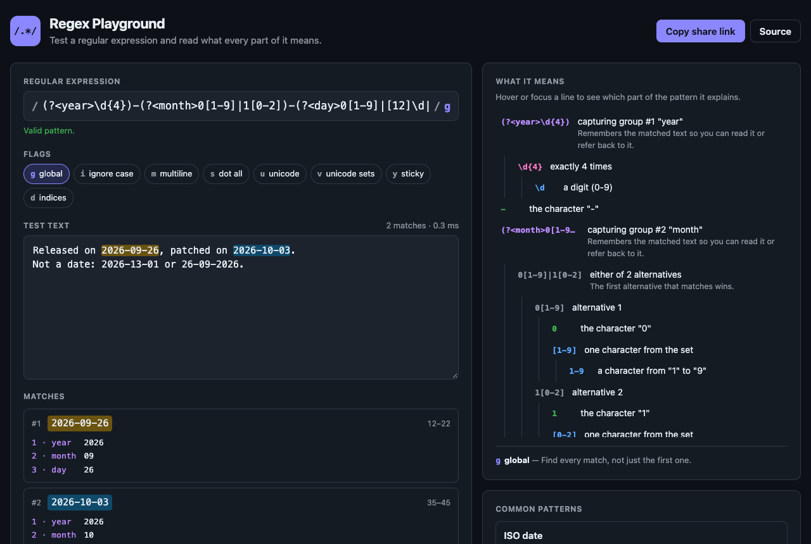

# Regex Playground

[English](README.md) · **Português (Brasil)**

[](https://github.com/FabianoArthur/regex-playground/actions/workflows/ci.yml)
[](LICENSE)

Escreva uma expressão regular, veja o que ela casa enquanto digita e leia o que cada parte significa.
As explicações vêm de um parser de regex escrito do zero. Não há IA nem servidor envolvidos, e nada do
que você digita sai da página.

**Demo:** <https://fabianoarthur.github.io/regex-playground/>



> A interface e as explicações do app são em inglês. Esta página descreve o projeto em português.

## Por que é interessante

- **Um parser de verdade, não uma tabela de consulta.** `src/regex/parser.ts` é um parser de descida
  recursiva para expressões regulares ECMAScript. Ele transforma o padrão numa árvore sintática com a
  posição de cada nó no texto. Segue as regras do motor nos dois modos: a sintaxe legada da web, sem
  `u`, em que `\101` é octal e um `{` sozinho é literal, e o modo unicode, mais estrito.
- **Conferido contra o próprio motor.** Um teste diferencial gera 20.000 padrões aleatórios e confere
  cada um nos dois modos. Para cada padrão, o parser precisa aceitar ou rejeitar exatamente o que o
  `new RegExp` aceita ou rejeita. Uma rodada maior, de 600.000 verificações, não achou nenhuma divergência.
- **Explicações que apontam para o padrão.** Cada linha da explicação sabe qual trecho do padrão
  descreve. Passe o mouse ou o foco numa linha e esse trecho acende no padrão.
- **Um padrão lento não trava a página.** O matching roda num Web Worker. Se um padrão entra em
  backtracking catastrófico, como `(a+)+$` contra `aaaa…!`, o worker é encerrado depois de 1 segundo e
  substituído.
- **Links compartilháveis.** Padrão, flags e texto de teste vão para o hash da URL, e o link reabre o
  mesmo estado. Nada fica guardado em servidor.
- **Renderização segura.** Texto do usuário só entra no DOM como nó de texto. O ESLint proíbe
  `innerHTML`, e o build de produção sai com uma Content-Security-Policy estrita.

| Claro | Escuro |
| --- | --- |
|  |  |

## Funcionalidades

- Destaque ao vivo de cada match no texto de teste, e uma lista dos matches com os grupos de captura
  (nomeados e numerados) e as posições.
- Uma árvore de explicação do padrão: literais, classes, intervalos, âncoras, grupos, lookarounds,
  backreferences, quantificadores gulosos e preguiçosos, propriedades Unicode, e o que cada flag faz.
- Erros de sintaxe mostrados com a posição, que fica marcada no padrão.
- Botões para as flags `g i m s u v y d`.
- Uma biblioteca com 12 padrões comuns (data ISO, e-mail, URL, IPv4, UUID, semver…). Os testes conferem
  que cada um aceita e rejeita o que promete.
- Navegável pelo teclado, com temas claro e escuro e layout responsivo até a largura de celular.

## Como funciona

<picture>
  <source media="(prefers-color-scheme: dark)" srcset="docs/assets/how-it-works.pt-BR-dark.svg">
  
</picture>

| Módulo | Responsabilidade |
| --- | --- |
| `src/regex/parser.ts` | Padrão → árvore sintática com posições, ou um `RegexSyntaxError` com a posição do erro |
| `src/regex/explain.ts` | Árvore → árvore de linhas explicativas, cada uma ligada ao seu trecho |
| `src/regex/match.ts` | Roda o motor nativo do jeito que o `exec` roda. Coleta matches e grupos, trata matches vazios, limita a 1.000 resultados |
| `src/worker/` | Tira o matching da thread principal, descarta resultado velho, mata o match descontrolado depois de 1 s |
| `src/highlight.ts` | Texto + matches → trechos ordenados para a camada de destaque |
| `src/share.ts` | Estado ↔ hash da URL, com limpeza das flags e limite de tamanho |
| `src/library.ts` | A biblioteca de padrões comuns, com exemplos que devem casar e que não devem |
| `src/main.ts` | Ligação com o DOM. Sem framework, cerca de 30 kB de JavaScript antes da compressão |

## Rodando localmente

Precisa do Node.js 20 ou mais novo.

```bash
npm ci
npm run dev        # http://localhost:5173
```

| Script | O que faz |
| --- | --- |
| `npm test` | Testes unitários (Vitest) |
| `npm run lint` | ESLint com typescript-eslint |
| `npm run typecheck` | `tsc --noEmit` em modo estrito |
| `npm run build` | Checa os tipos e gera o build em `dist/` |
| `npm run preview` | Serve o build de produção |

## Testes

192 testes cobrindo o parser, o explicador, o matcher, o worker, o destaque, o link compartilhável e a
biblioteca de padrões, incluindo o teste diferencial contra o motor. O CI roda lint, checagem de tipos,
testes, build e varredura de segredos com gitleaks em todo push e pull request.

## Deploy

`.github/workflows/deploy.yml` gera o site e publica no GitHub Pages a cada push na branch padrão.

## Licença

[MIT](LICENSE) © 2026 Fabiano Arthur
